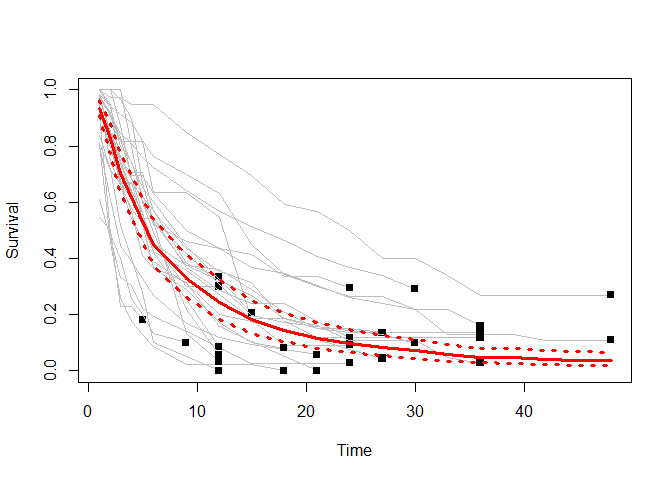
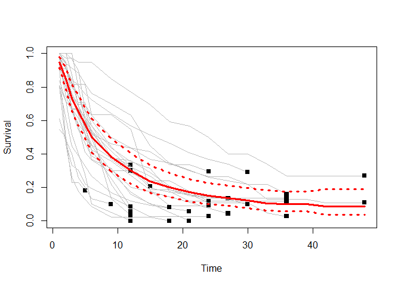

<!-- README.md is generated from README.Rmd. Please edit that file -->

# metaSurvival

<!-- badges: start -->

[](https://www.tidyverse.org/lifecycle/#mature)
[](https://opensource.org/licenses/MIT)
[](https://github.com/shubhrampandey/metaSurvival/commit/master)
[](https://CRAN.R-project.org/package=metaSurvival)
[](https://CRAN.R-project.org/package=metaSurvival)
<!-- badges: end -->

### Download stats for CRAN

<!-- badges: start -->

[](https://cran.r-project.org/package=metaSurvival)
[](https://cran.r-project.org/package=metaSurvival)
[](https://cran.r-project.org/package=metaSurvival)
<!-- badges: end -->

The goal of metaSurvival is to perform Meta-analysis of a single
survival curve using the multivariate methodology of DerSimonian and
Laird.

## Installation

You can install the released version of metaSurvival from
[CRAN](https://CRAN.R-project.org) with:

``` r
install.packages("metaSurvival")
```

And the development version from [GitHub](https://github.com/) with:

``` r
# install.packages("devtools")
devtools::install_github("shubhrampandey/metaSurvival")
```

## Example

``` r
library(metaSurvival)
```

First start with loading the example dataset.

``` r
data(exampleData)
attach(exampleData)
head(exampleData)
#>   Study FirstAuthor YearPub Time Survival NbRisk Location      Design
#> 1     1         Lai    1988    1   0.8043     46     Asia Monocentric
#> 2     1         Lai    1988    2   0.4565     37     Asia Monocentric
#> 3     1         Lai    1988    3   0.2609     21     Asia Monocentric
#> 4     1         Lai    1988    4   0.1739     12     Asia Monocentric
#> 5     1         Lai    1988    5   0.1304      8     Asia Monocentric
#> 6     1         Lai    1988    6   0.0870      6     Asia Monocentric
```

Computation of summary survival with continuity
correction.

``` r
results<-msurv(Study, Time, NbRisk, Survival, confidence="Greenwood",correctionFlag = T,correctionVal = c(0.25,0.5))
results
#> $verif.data
#>    Sstudy check
#> 1       1     1
#> 2       2     1
#> 3       3     1
#> 4       4     1
#> 5       5     1
#> 6       6     1
#> 7       7     1
#> 8       8     1
#> 9       9     1
#> 10     10     1
#> 11     11     1
#> 12     12     1
#> 13     13     1
#> 14     14     1
#> 15     15     1
#> 16     16     1
#> 17     17     1
#> 18     18     1
#> 19     19     1
#> 20     20     1
#> 21     21     1
#> 22     22     1
#> 23     23     1
#> 24     24     1
#> 25     25     1
#> 26     26     1
#> 27     27     1
#> 
#> $summary.fixed
#>       IndiceTimes PooledSurvivalFE PooledSurvivalICinfFE PooledSurvivalICsupFE
#>  [1,]           1       0.94497450            0.93455418            0.95551100
#>  [2,]           2       0.84347436            0.82683765            0.86044583
#>  [3,]           3       0.73872717            0.71857893            0.75944035
#>  [4,]           4       0.66245129            0.64073764            0.68490079
#>  [5,]           5       0.58662304            0.56399133            0.61016291
#>  [6,]           6       0.52144090            0.49844475            0.54549799
#>  [7,]           9       0.40882896            0.38592475            0.43309252
#>  [8,]          12       0.32461488            0.30222075            0.34866838
#>  [9,]          15       0.26174091            0.23995379            0.28550624
#> [10,]          18       0.21983127            0.19855264            0.24339029
#> [11,]          21       0.18810271            0.16733508            0.21144777
#> [12,]          24       0.16086195            0.14062988            0.18400476
#> [13,]          27       0.13906070            0.11917994            0.16225783
#> [14,]          30       0.12241028            0.10252475            0.14615276
#> [15,]          33       0.09697105            0.07643349            0.12302702
#> [16,]          36       0.08104941            0.06104672            0.10760623
#> [17,]          39       0.07799121            0.05761503            0.10557365
#> [18,]          42       0.06960868            0.04863084            0.09963571
#> [19,]          45       0.06635655            0.04527093            0.09726311
#> [20,]          48       0.06295069            0.04180072            0.09480195
#> 
#> $median.fixed
#>              2.5%    97.5% 
#> 6.571189 5.959476 7.137555 
#> 
#> $mean.fixed
#>              2.5%    97.5% 
#> 12.06584 11.28742 12.74679 
#> 
#> $heterogeneity
#> [1] 731.217128   2.521438  60.340098
#> 
#> $summary.random
#>       IndiceTimes PooledSurvivalRE PooledSurvivalICinfRE PooledSurvivalICsupRE
#>  [1,]           1       0.93524921            0.90753843            0.96380610
#>  [2,]           2       0.82628083            0.77535470            0.88055185
#>  [3,]           3       0.70123428            0.63503595            0.77433335
#>  [4,]           4       0.61766270            0.54632825            0.69831133
#>  [5,]           5       0.53060766            0.45992592            0.61215181
#>  [6,]           6       0.44916320            0.37511275            0.53783184
#>  [7,]           9       0.32921715            0.26232834            0.41316134
#>  [8,]          12       0.24431166            0.18426527            0.32392532
#>  [9,]          15       0.18160515            0.13130502            0.25117417
#> [10,]          18       0.14534074            0.10284269            0.20540041
#> [11,]          21       0.11674507            0.07979975            0.17079517
#> [12,]          24       0.09822802            0.06593733            0.14633204
#> [13,]          27       0.08346181            0.05491511            0.12684802
#> [14,]          30       0.07097460            0.04554526            0.11060193
#> [15,]          33       0.05659698            0.03461920            0.09252720
#> [16,]          36       0.04869511            0.02927924            0.08098617
#> [17,]          39       0.04682745            0.02783640            0.07877493
#> [18,]          42       0.03866701            0.02088712            0.07158177
#> [19,]          45       0.03689963            0.01966964            0.06922256
#> [20,]          48       0.03516081            0.01850465            0.06680927
#> 
#> $median.random
#>              2.5%    97.5% 
#> 5.375810 4.491524 6.790295 
#> 
#> $mean.random
#>                2.5%     97.5% 
#>  9.554813  7.800112 11.560362
```

Plot the estimates summary survival

``` r
RandomEffectSummary<- results$summary.random

plot(Time, Survival, type="n", col="grey", ylim=c(0,1),xlab="Time",
 ylab="Survival")
 
for (i in unique(sort(Study))){
lines(Time[Study==i], Survival[Study==i], type="l", col="grey")
points(max(Time[Study==i]),
 Survival[Study==i & Time==max(Time[Study==i])], pch=15)
}

lines(RandomEffectSummary[,1], RandomEffectSummary[,2], type="l",
 col="red", lwd=3)
points(RandomEffectSummary[,1], RandomEffectSummary[,3], type="l",
 col="red", lty=3, lwd=3)
points(RandomEffectSummary[,1], RandomEffectSummary[,4], type="l",
 col="red", lty=3, lwd=3)
```



Computation of summary survival without continuity
correction.

``` r
results<-msurv(Study, Time, NbRisk, Survival, confidence="Greenwood",correctionFlag = F)
results
#> $verif.data
#>    Sstudy check
#> 1       1     1
#> 2       2     1
#> 3       3     1
#> 4       4     1
#> 5       5     1
#> 6       6     1
#> 7       7     1
#> 8       8     1
#> 9       9     1
#> 10     10     1
#> 11     11     1
#> 12     12     1
#> 13     13     1
#> 14     14     1
#> 15     15     1
#> 16     16     1
#> 17     17     1
#> 18     18     1
#> 19     19     1
#> 20     20     1
#> 21     21     1
#> 22     22     1
#> 23     23     1
#> 24     24     1
#> 25     25     1
#> 26     26     1
#> 27     27     1
#> 
#> $summary.fixed
#>       IndiceTimes PooledSurvivalFE PooledSurvivalICinfFE PooledSurvivalICsupFE
#>  [1,]           1        0.9508837            0.93115618             0.9710293
#>  [2,]           2        0.8542395            0.82202310             0.8877185
#>  [3,]           3        0.7529489            0.71356234             0.7945096
#>  [4,]           4        0.6801444            0.63752795             0.7256097
#>  [5,]           5        0.6081467            0.56352148             0.6563058
#>  [6,]           6        0.5449696            0.49936809             0.5947354
#>  [7,]           9        0.4303415            0.38446782             0.4816886
#>  [8,]          12        0.3452733            0.30011887             0.3972213
#>  [9,]          15        0.2814425            0.23729653             0.3338012
#> [10,]          18        0.2411057            0.19773211             0.2939935
#> [11,]          21        0.2109529            0.16828161             0.2644443
#> [12,]          24        0.1858428            0.14380950             0.2401619
#> [13,]          27        0.1671095            0.12528742             0.2228921
#> [14,]          30        0.1549979            0.11269730             0.2131760
#> [15,]          33        0.1322367            0.08722757             0.2004703
#> [16,]          36        0.1201395            0.07462625             0.1934106
#> [17,]          39        0.1201395            0.07462625             0.1934106
#> [18,]          42        0.1144864            0.06665886             0.1966300
#> [19,]          45        0.1144864            0.06665886             0.1966300
#> [20,]          48        0.1144864            0.06665886             0.1966300
#> 
#> $median.fixed
#>              2.5%    97.5% 
#> 7.176926 5.930531 8.347162 
#> 
#> $mean.fixed
#>              2.5%    97.5% 
#> 13.46370 11.46631 14.72920 
#> 
#> $heterogeneity
#> [1] 219.6071244   0.7572659   0.0000000
#> 
#> $summary.random
#>       IndiceTimes PooledSurvivalRE PooledSurvivalICinfRE PooledSurvivalICsupRE
#>  [1,]           1       0.94768647            0.91731470             0.9790638
#>  [2,]           2       0.84755282            0.78823478             0.9113348
#>  [3,]           3       0.73182809            0.65606515             0.8163402
#>  [4,]           4       0.65409564            0.56903170             0.7518757
#>  [5,]           5       0.57872161            0.49473929             0.6769600
#>  [6,]           6       0.50184228            0.41034422             0.6137425
#>  [7,]           9       0.38269038            0.29711268             0.4929171
#>  [8,]          12       0.29890154            0.22167479             0.4030324
#>  [9,]          15       0.23629264            0.16877051             0.3308292
#> [10,]          18       0.20208143            0.14274382             0.2860853
#> [11,]          21       0.17082971            0.11580178             0.2520064
#> [12,]          24       0.15126442            0.10079984             0.2269937
#> [13,]          27       0.13757394            0.09019805             0.2098337
#> [14,]          30       0.12300453            0.07677350             0.1970747
#> [15,]          33       0.10536383            0.06049565             0.1835097
#> [16,]          36       0.10074068            0.05720945             0.1773952
#> [17,]          39       0.10074068            0.05720945             0.1773952
#> [18,]          42       0.08499342            0.03811229             0.1895420
#> [19,]          45       0.08499342            0.03811229             0.1895420
#> [20,]          48       0.08499342            0.03811229             0.1895420
#> 
#> $median.random
#>              2.5%    97.5% 
#> 6.046385 4.821474 8.482457 
#> 
#> $mean.random
#>              2.5%    97.5% 
#> 11.92947  9.15848 14.37860
```

Plot the estimates summary survival

``` r
RandomEffectSummary<- results$summary.random

plot(Time, Survival, type="n", col="grey", ylim=c(0,1),xlab="Time",
 ylab="Survival")
 
for (i in unique(sort(Study))){
lines(Time[Study==i], Survival[Study==i], type="l", col="grey")
points(max(Time[Study==i]),
 Survival[Study==i & Time==max(Time[Study==i])], pch=15)
}

lines(RandomEffectSummary[,1], RandomEffectSummary[,2], type="l",
 col="red", lwd=3)
points(RandomEffectSummary[,1], RandomEffectSummary[,3], type="l",
 col="red", lty=3, lwd=3)
points(RandomEffectSummary[,1], RandomEffectSummary[,4], type="l",
 col="red", lty=3, lwd=3)
```


